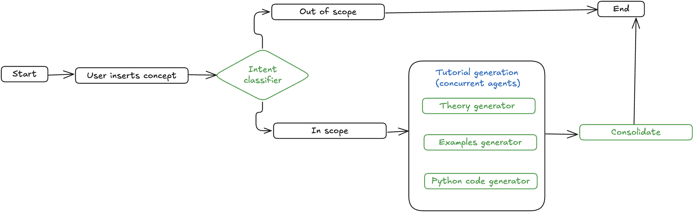

# LLM Agents from Scratch Using Asynchronous Programming - Ollama 

Mohammed Mahyoub 

## Agentic System Description: Data Science Tutorial Generator
A Streamlit web application that generates comprehensive data science tutorials using async AI agents. Users input a concept, and the system validates the scope then creates structured tutorials with downloadable markdown output.

- **Intent Classifier**: Validates if the input concept is within data science scope
- **Theory Agent**: Creates detailed theoretical explanations and foundations  
- **Examples Agent**: Generates real-world use cases and practical scenarios
- **Python Code Agent**: Produces executable code examples with documentation
- **Consolidator Agent**: Combines all sections into a cohesive tutorial document 

## Asynchronous Agent Architecture
The system leverages async programming to run multiple agents concurrently, significantly accelerating the tutorial generation process. While the Intent Classifier validates the input sequentially, the Theory, Examples, and Python Code agents execute simultaneously, reducing total processing time from sequential execution to the duration of the longest-running agent.



## Environment Setup 
Run the sync command to set up the environment. Prerequisite is the uv package manager. Install uv from https://docs.astral.sh/uv/getting-started/installation/
```bash 
uv sync 
```

## LLM Configuration
This system uses open-source LLM using Ollama as the underlying language model. You need to configure Ollama and add the model name to the `.env` file. A `.env.example` file is provided as a template.

As an example, we will be using `gpt-oss:20b`. 

Pull the model from Ollama hub. 
```bash
uv run pull_model.py
```

## Run System
```bash 
uv run streamlit run app.py
```

Alternatively, if you have activated the virtual environment:
```bash 
streamlit run app.py
```